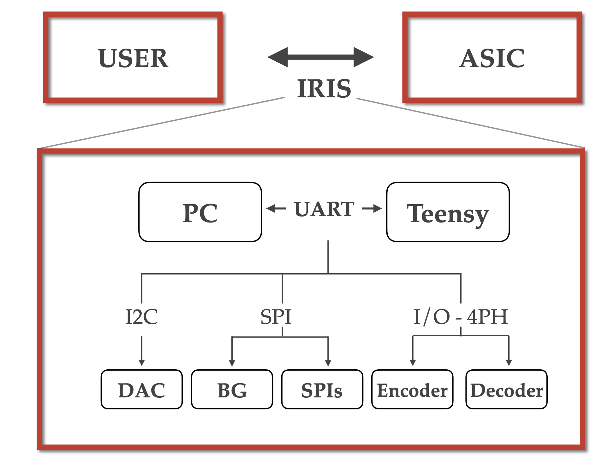

# IRIS: Interface for Real time Intelligent Systems

##  Overview

IRIS contains the necessary resources to interface custom ASICS built in the NCS group with Teensy microcontroller boards. 
IRIS enables novel chips to be prototyped and tested quickly and efficiently without having to deal with tedious interfacing.  It interfaces seamlessly different communication protocols such as I2C, SPI and custom four phase handshakes. Doing so  different building blocks can be reconfigured to meet the demands of any new chip.

The building blocks it supports are:
- DAC
- Input interface
- SPI
- BiasGenerator
- Output Encoder

![][documentation/interface.png]

## Code overview

A user friendly GUI controls the backend which runs on the teensy board. Communication between these two parts is crucial and ensures accurate transmission of all data.

## Frontend

The frontend runs using the 'Dear ImGui' (https://github.com/ocornut/imgui) C++ interface with GLFW (http://www.glfw.org) and OpenGL (https://www.opengl.org/) backends. The relevant files of ImGui and OpenGL are included in this repository. 

## Backend

This code is compiled and uploaded using "PlatformIO" plugin on Visual Studio Code.

## Getting Started

1. Install the required dependencies (GLFW, platformIO plugin)
2. Connect the Teensy to the PC and check how it appears in the /dev directory. You can do this by running `ls /dev`. It will typically appear as `ttyACM0`, however it may also appear under another name, depending on your machine. If it does not appear as `ttyACM0`, update the `SERIAl_PORT_NAME` variable in the `teensy_backend/include/constants.h` file.
3. Upload the backend code to Teensy using the PlatformIO plugin.
4. In the `imgui_frontend` directory, run the shell script `clean_build_ruh.sh`. This will build and run an `alive_interface` executable.

Current boards that have been tested are:
- ALIVE
- SPIAC
- AHPC

## Contributors:
* Matteo Cartiglia
* Adrian Whatley

