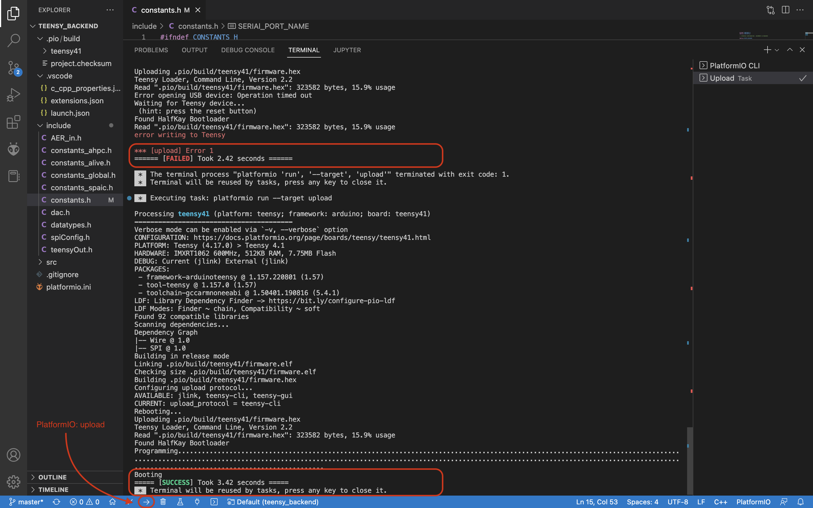

# ALIVE Chip: MacOS Manual

To be able to communicate with the ALIVE chip, we use the microcontroller Teensy 4.1. The Visual Studio Software with the PlatformIO IDE extention allows us to load programs onto Teensy using Arduino.

The GitLab repository `ncs_teensy_interface` contains two folders, `imgui_frontend` and `teensy_backend`. `teensy_backend` contains code that allows us to write programs to Teensy, whereas `imgui_frontend` is the graphic user interface, here called `alive_interface`. This allows us to interact with the neurons through Teensy. To run `imgui_frontend`, we need to install GLFW, which might require Homebrew to install it.


## Set up your computer

1. **Install Visual Studio Code Software**

You can download Visual Studio here: https://code.visualstudio.com/Download

2. **Install required dependencies (PlatformIO IDE plugin, GLFW)**

Search for `PlatformIO IDE` extention in Visual Studio Code and install it.
For Linux, Please also install the venv package (in base python) and restart IDE
```sudo apt-get install python3-venv```
(Otherwise, you will recieve "Python Interpretor path not found" error. [See this Git issue for details](https://github.com/platformio/platformio-core-installer/issues/1774))

Install Homebrew (https://brew.sh).
- Run `/bin/bash -c "$(curl -fsSL https://raw.githubusercontent.com/Homebrew/install/HEAD/install.sh)"` in terminal
- Enter your username password to give access to install Homebrew
- Follow the instructions displayed in the terminal
- Run `brew install glfw` in terminal to install GLFW


3. **Clone GitLab repository**

You can find the required GitLab repository here: https://code.ini.uzh.ch/camatteo/ncs_teensy_interface/-/tree/master/
- Clone the repository with HTTPS: https://code.ini.uzh.ch/camatteo/ncs_teensy_interface.git
- Run `git clone https://code.ini.uzh.ch/camatteo/ncs_teensy_interface.git` in terminal
- Give access to the folder and enter your username and password, if necessary


Note: The cloned repository will automatically be saved in the current folder, with `cd "Folder name"` you can open a folder and therefore change where it should be saved. You can also try to clone the repository with SSH, as this should work as well.


## Connect teensy to computer

Open the two folders `imgui_frontend` and `teensy_backend` in Visual Studio. It might be best to open them in two different windows.

Connect the Teensy to the PC and check how it appears in the /dev directory. You can do this by running `ls /dev` in the terminal. It will typically appear as `ttyACM0`, however it may also appear under another name, depending on your machine. If it does not appear as `ttyACM0`, update the `SERIAl_PORT_NAME` variable in the `teensy_backend/include/constants.h` file.

Please note, that the Teensy might appear as something like `tty.usbmodem123456789`, but you should change the `SERIAl_PORT_NAME` to `"/dev/cu.usbmodem123456789"` and not `"/dev/tyy.usbmodem123456789"`.


Afterward, press `PlatformIO: upload`. The first time, there is often an upload error. Upload it again until it succeeds.




Should it not appear in the /dev directory, download Teensyduino (https://www.pjrc.com/teensy/td_download.html). Open the program and choose the correct port under `Tools > Port`. Click on the upload button (it will upload a sketch to the teensy). Rerun `ls /dev` and check if Teensy appears. If not, repeat it with a different port.


In the `imgui_frontend` directory, run the shell script `clean_build_run.sh` by running `./clean_build_run.sh` in the Terminal. This will build and run an `alive_interface` executable. A new window with the `ALIVE Testing Interface` will appear.

If the `alive_interface` does not open, you might need to close the Serial Monitor. Go to `teensy_backend` and delete `Monitor Task` in the window to the right of the Terminal.


## ALIVE Testing Interface

The `ALIVE Testing Interface` has 5 different windows:
- Input Interface
- Test Structure Biases [DAC Values]
- Bias Generator Configuration
- Log
- Encoder Output


The Log Window shows the history. The Input Interface is our Decoder, where we can enter which synapse we want to target and how many requests it should send. The Test Structure Biases is used for the two learning blocks LB CC and LB NN outside of the cores, whereas the Bias Generator Configuration can be used to change biases for the neurons, synapses and learning blocks inside the cores. In the Encoder Output, we can use `Handshake: Encoder`, if the connection seems to not work anymore.

Bias Generator Configuration will save the data in the `data/customBiasValues/BIASGEN/` folder. Even if you change the file name, it will be saved as `untitled.csv`. Be careful to change the name in Visual Studio, as the next saved file will overwrite this one if the name is not changed.

Test Structure Biases [DAC Values] saves the data in the `data/customBiasValues/DAC/` folder. Same as for the Bias Generator Configuration, it will be saved as `untitled.csv` and you need to rename it in Visual Studio.


Press `update` every time you change the biases. To send the input to the ALIVE chip, press `Send Packet to Teensy`.

## [Set up PlatformIO Core (CLI)](https://docs.platformio.org/en/stable/core/index.html#piocore)

This is to get access to the MCU via the comandline with PlatformIO.

`piocore` consists of 2 standalone tools in a system:

* [``platformio`` or ``pio`` (short alias)](https://docs.platformio.org/en/stable/core/userguide/index.html#piocore-userguide)
* [``piodebuggdb``](https://docs.platformio.org/en/stable/core/userguide/cmd_debug.html#cmd-debug)

If you have already installed the PIO plugin in VS Code, you do not need to install `piocore` separately. Just link these tools with your shell:

# Unix and Unix-like

In Unix and Unix-like systems, you can create symbolic links (symlinks) in your ``$HOME/.local/bin/`` directory to the necessary PlatformIO executables. This will allow you to execute ``platformio`` commands from any terminal emulator as long as you're logged in as the user PlatformIO is installed and configured for. 

If it's not already the case, you should consult the OS specific guidelines at the PlatformIO CLI installation manual [here](https://docs.platformio.org/en/latest/core/installation/shell-commands.html). After everything's done, just restart your session (log out and log back in) and you're good to go.

In some cases, Linux users might have to install udev rules for PlatformIO supported boards/devices. The instructions can be found [here](https://docs.platformio.org/en/latest/core/installation/udev-rules.html) for the same. 

Or (not the recommended way) you can directly do

```echo 'export PATH=$PATH:~/.platformio/penv/bin' >> ~/.bashrc```

Then you are ready to go with building and uploading projects via the comandline.

## Create a PlatformIO Project

- 1. Create a new PlatformIO project or navigate to an existing one using the terminal. You can create a new project with the following command:

```bash
pio project init --board=teensyxx
```

Replace teensyxx with the appropriate Teensy board identifier if you're using a different one.

The ```pio project init``` command requires specifying board identifier ID. It can be found using ```pio boards``` command. More details [here](https://docs.platformio.org/en/latest/core/quickstart.html#setting-up-the-project). 

- 2. Write Your Code
Open the main source file of your project (src/main.cpp by default) and write your Teensy code.

- 3. Connect Teensy
Connect your Teensy microcontroller to your computer via USB.

- 4. Build the Project
Build your project using the following command:

```bash
pio run
```
- 5. Upload the Code
Upload the compiled code to the Teensy using the following command:

```bash
pio run -t upload
```
This will compile the code and upload it to the connected Teensy.

- 6. Monitor Serial Output (Optional)
If your code involves serial communication, you can monitor the serial output using:

```bash
pio device monitor
```
This will open a serial monitor and display the output from the Teensy.

Remember to adapt the commands based on your specific project and Teensy (or any other board) board. The board identifier, such as teensyxx, should match your Teensy model.

Please note that the exact steps may vary based on your project structure and requirements. Refer to the PlatformIO documentation for any additional details specific to your use case [PlatformIO Documentation](https://docs.platformio.org/en/latest/)
